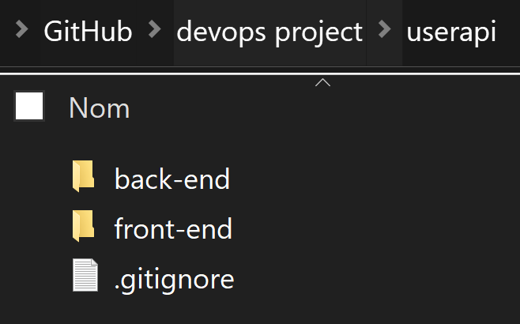
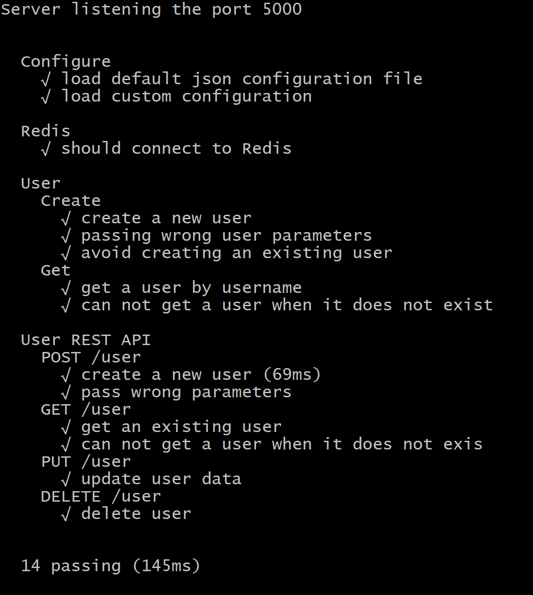
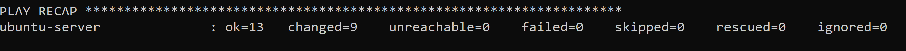
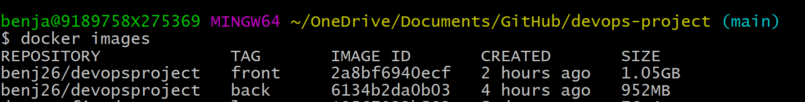
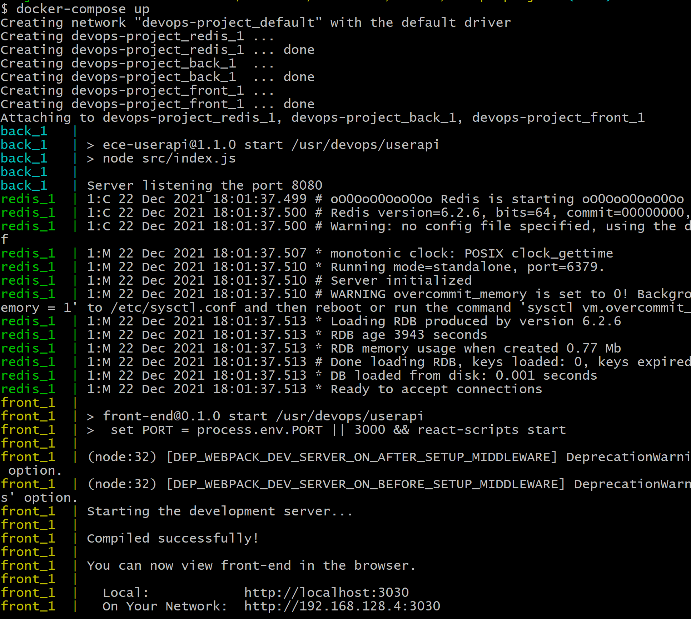

#	Devops 


##	Instructions

###	1. Create a web application

We created a basic CRUD application made of a back-end and a front-end.



The back-end is there to handle the communication with our redis database and the front-end is a basic React application handling user actions 


In the back , we use unit testing via mocha and chai to check the connection to redis as well as the CRUD actions that may be attented by the user



From the back-end run :

````bash
#Install dependencies
npm i
#Launch mocha testing
npm test
#launch the server (dev launches it with nodemon)
npm start or npm dev
````

From the front-end : 

````bash
#Install dependencies
npm i
#launch the user interface
npm start
````


###	2. Apply CI/CD pipeline

1. Continuous integration

   We added the `.github/wordkflow/integration.yml` file to handle continuous integration.

   It launches on push and pull requests to the main branch as you can see here :

   ````yaml
   on:
     push:
       branches: [ main ]
     pull_request:
       branches: [ main ]
   ````

   We use matrix so that it runs on different versions on Node and redis : 

   ```yaml
   strategy:
     matrix:
       node-version: [12.x, 14.x, 16.x]
       redis-version: [4, 5, 6]
   ```

   It has 3 jobs : 

   - get node

   ````yaml
       - name: Use Node.js ${{ matrix.node-version }}
         uses: actions/setup-node@v2
         with:
           node-version: ${{ matrix.node-version }}
           cache: 'npm'
           cache-dependency-path: ./userapi/back-end/package-lock.json
   ````

   - get redis

   ````yaml
      - name: Start Redis
         uses: supercharge/redis-github-action@1.2.0
         with:
           redis-version: ${{ matrix.redis-version }}
   ````

   - run our api unit tests

   ````yaml
       - name: using npm
         run: |
           npm ci
           npm run build --if-present
           npm test
         working-directory: ./userapi/back-end 
   ````

2. Continuous delivery

​		We connected our github repository to heroku


###	3. Configure and provision a virtual environment and run your application using the IaC approach

In the Iac folder you will find a `Vagrantfile` that is used to create a virtual machine on VirtualBox or vmWare.

The VM is based on `ubuntu/trusty64` and we set its name, memory, ip and number of CPUs.

```ruby
# -*- mode: ruby -*-
# vi: set ft=ruby :

Vagrant.configure("2") do |config|
    
    if Vagrant.has_plugin?("vagrant-vbguest")
        config.vm.provider :virtualbox do |vb|
            config.vbguest.auto_update = false
        end
    end

    config.vm.define "ubuntu-server" do |ubuntu|
        ubuntu.vm.box = 'ubuntu/trusty64'
        ubuntu.vm.network :private_network, ip: "20.20.20.2"

        config.vm.provider "virtualbox" do |v|
            v.name = 'devops'
            v.memory = 2048
            v.cpus = 1
        end

        config.vm.provider "vmware_desktop" do |vmware|
            vmware.vmx["memsize"] = "2048"
            vmware.vmx["numvcpus"] = "1"
        end
    end

    config.vm.provision "ansible_local" do |ansible|
        ansible.playbook = "ansible.yml"
    end
    config.vm.synced_folder "../userapi", "/home/devops/userapi"
end
```


We also provision it with an `ansible playbook` named `ansible.yaml` from wich we install:

- Nodejs
- Redis
- our application (using *sync folders*)

We make some of its actions asynchronous in order to force the context switch when the actions block the command prompt (launching redis-server for example)

Here you can see how we dowlnoaded and lauched Redis as a snap of the whole `ansible.yaml` file : 

````yml
 - name: redis source download
   	get_url:
     url: http://download.redis.io/redis-stable.tar.gz 
     dest: /home/devops
    
 - name: redis unarchive
    ansible.builtin.unarchive:
     src: /home/devops/redis-stable.tar.gz
     dest: /home/devops
    
 - name: make install
    command: 
     chdir=/home/devops/redis-stable make install
    
 - name: Launching Redis database
    command: redis-server
    async: 10000000
    poll: 0
````


You can see below our play recap




From the iac folder open your command prompt and run : 

````bash
# Starting from scratch will create the VM and
# provision it from the ansible.yml file
vagrant up
# If the Vm already exists and you just want to 
# change its provisions
vagrant provision
````


###	4. Build Docker image of your application

Since our api is divided in 2 parts, we need to build 2 images (one for the front and one for the back)

So we have 2 Dockerfiles that are almost the same designed to launch their respective application

````ruby
FROM node:12
# create a working directory in the image
WORKDIR /usr/devops/userapi
#copy the content of the current directory in it
COPY ./ ./
#install dependencies
RUN npm install
#select a launch port
EXPOSE 3030
#start the application
CMD ["npm","start"]
````

There are two diffenreces between the files : 

1. the folder they are in 

   ````
   root
    |-userapi
    	  |-front-end
    	      |-Dockerfile
    	  |-back-end
    	      |-Dockerfile
   ````

2. the port they expose :
   1. The front-end is on port 3030
   2. the back-end is on port 8080

We build them by launching the following command from the right directory : 

````bash
# we follow this name template so that we can push our images
# in the same docker repository
#docker build -t <hub-user>/<repo-name>[:<tag>] . 
docker build -t benj26/devopsproject:back . 
docker build -t benj26/devopsproject:front .
````

you can see them here : 



Once they are built, we push them to docker hub : 

````bash
#	docker push <hub-user>/<repo-name>:<tag>
docker push benj26/devopsproject:back
docker push benj26/devopsproject:front
````

Here they are :


###	5. Make container orchestration using Docker Compose

Our `docker-compose.yaml` is tasked to launch the app, so it must do 3 things chronologically :

1. launch redis

   ````yaml
     redis:
       image: redis
       volumes: 
         - redis-data:/data
       ports:
         - 6379:6379
   #	Not directly after in the real code
   volumes:
     redis-data : {}
   ````

   Here, we get the [official redis image](https://hub.docker.com/_/redis) from docker, give it a volume so that the data remains when the application shuts down and set its access port to 6379 (redis default port) on both the container and the user sides

1. launch the back-end

   ````yaml
     back:
       depends_on: # waits until the redis service is completed
         - redis
       build: ./userapi/back-end # builds our Dockerfile
       ports: # sets the access port to 8080
         - 8080:8080
       environment: # defines environment variable
         REDIS_HOST: redis
         REDIS_PORT: 6379
         LAUNCH_PORT: 8080
   ````

2. launch the front-end

   ````yaml
     front:
       depends_on: # waits for back service
         - back
       build: ./userapi/front-end # builds dockerfile
       ports: # set ports
         - 3030:3030 
       environment: # set environment variable
         PORT: 3030 
   ````

The environment variables are used in the api to make sure that the connections between redis the front and the back are done on the right ports : 

````js
//back connection with redis
var db = redis.createClient({
  host:  process.env.REDIS_HOST || config.redis.host,
  port:  process.env.REDIS_PORT || config.redis.port,
})
//request from the front to the back
axios.post(`http://localhost:${port}/user`, newUser)
````

The `docker-compose.yaml` file is based at the root of the project, so once everything is ready we launch it from there with 

````bash
docker-compose up
````

it shows : 



We can see that the 3 services have started and that they are launching on their docker ports.


And we have a perfectly fonctionning app waiting on port `3030`

###	6. Make docker orchestration using Kubernetes

In this part, we will try to create deployment and expose the Kubernetes service to the outside with the port the service has been attached with.

We start first by running minikube 

```shell
minikube start
```

and verify its status


Next, we create the deployment then expose it through the port 8080.

```shell
kubectl create deployment kubernetes-bootcamp
kubectl expose deployments/kubernetes-bootcamp
```

using `kubectl get services` we verifiy that the app is correctly running


Since it is working we can launch the service with : 

````bash
minikube service kubernetes-bootcamp
````


The app is now accessible at `http://127.0.0.1:61388`


Here is our `deployment.yaml` file : 

````yaml
apiVersion: apps/v1
kind: Deployment
metadata:
  name: kubernetes-bootcamp
  labels:
    app: kubernetes-bootcamp
spec:
  replicas: 3
  selector:
    matchLabels:
      app: kubernetes-bootcamp
  template:
    metadata:
      labels:
        app: kubernetes-bootcamp
    spec:
      containers:
      - name: kubernetes-bootcamp
        image: kubernetes-bootcamp:1.14.2
        ports:
        - containerPort: 80

````


and our services.yaml : 

````yaml
apiVersion: v1
kind: Service
metadata:
  name: kubernetes-bootcamp-service
spec:
  type: NodePort
  selector:
    app: MyApp
  ports:
    - protocol: TCP
      port: 80
      targetPort: 9376
````


In order to keep data between utilisation, we have to include a volume to our kubernetes configuration. We can do it either by using persintent volume : 

```yaml
apiVersion: v1
kind: PersistentVolume
metadata:
  name: task-pv-volume
  labels:
    type: local
spec:
  storageClassName: manual
  capacity:
    storage: 10Gi
  accessModes:
    - ReadWriteOnce
  hostPath:
    path: "/mnt/data"
```

or with persistent volume claim: 

```yaml
apiVersion: v1
kind: PersistentVolumeClaim
metadata:
  name: task-pv-claim
spec:
  storageClassName: manual
  accessModes:
    - ReadWriteOnce
  resources:
    requests:
      storage: 3Gi
```

